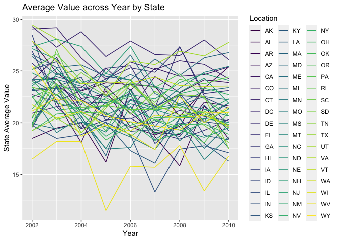
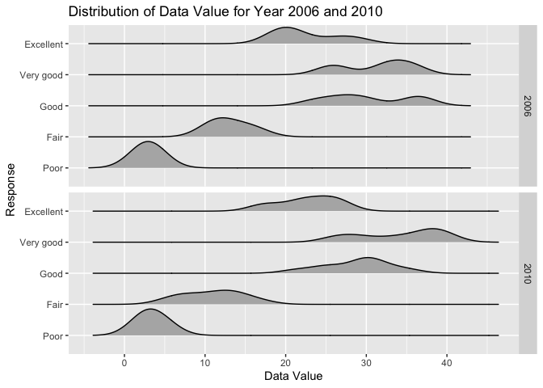
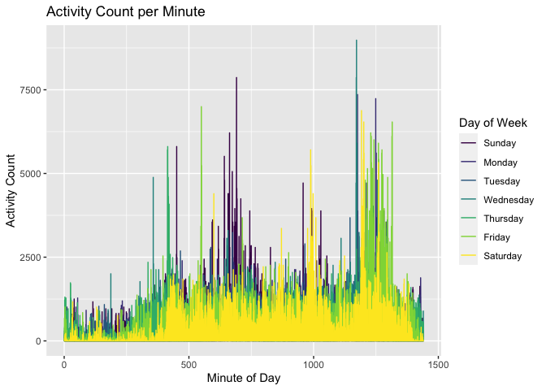

p8105\_hw3\_pm3148
================
Pooja Mukund
10/15/2021

# Load Libraries

``` r
library(tidyverse)
```

    ## ── Attaching packages ─────────────────────────────────────── tidyverse 1.3.1 ──

    ## ✓ ggplot2 3.3.5     ✓ purrr   0.3.4
    ## ✓ tibble  3.1.4     ✓ dplyr   1.0.7
    ## ✓ tidyr   1.1.3     ✓ stringr 1.4.0
    ## ✓ readr   2.0.1     ✓ forcats 0.5.1

    ## ── Conflicts ────────────────────────────────────────── tidyverse_conflicts() ──
    ## x dplyr::filter() masks stats::filter()
    ## x dplyr::lag()    masks stats::lag()

``` r
library(p8105.datasets)
library(ggridges)
```

# Problem 1: Instacart

``` r
#Load data
data("instacart")
```

``` r
#How many aisles are there, and which aisles are the most items ordered from?
instacart%>%
  group_by(aisle)%>%
  summarize(count = n())%>%
  arrange(desc(count))
```

    ## # A tibble: 134 × 2
    ##    aisle                          count
    ##    <chr>                          <int>
    ##  1 fresh vegetables              150609
    ##  2 fresh fruits                  150473
    ##  3 packaged vegetables fruits     78493
    ##  4 yogurt                         55240
    ##  5 packaged cheese                41699
    ##  6 water seltzer sparkling water  36617
    ##  7 milk                           32644
    ##  8 chips pretzels                 31269
    ##  9 soy lactosefree                26240
    ## 10 bread                          23635
    ## # … with 124 more rows

The table shows that we have 134 unique aisles represented in the
dataset. Fresh vegetables, fresh fruits, and packages vegetable fruits
are the aisles with the largest amount of records/purchases.

``` r
#Make a plot that shows the number of items ordered in each aisle, limiting this to aisles with more than 10000 items ordered. Arrange aisles sensibly, and organize your plot so others can read it.
instacart%>%
  group_by(aisle)%>%
  summarize(count = n())%>%
  filter(count > 10000)%>%
  arrange(desc(count))%>%
  ggplot(aes(x=reorder(aisle, count), y = count)) + 
  geom_bar(stat="identity")+
  coord_flip()+
  labs(caption = "Limited to aisles with more than 10000 items ordered") + 
  xlab("Aisle Name") + ylab("Count of Items Ordered") + ggtitle("Number of items ordered by aisle") +
  theme(axis.text.y = element_text(size =7))
```

<!-- -->

Fresh vegetables, fresh fruits, and packaged vegetables fruits have the
highest amount of items ordered from. Butter, oils vinegars, and dry
pasta have the lowest amount of items in this subset (items &gt;
10,000).

``` r
#Make a table showing the three most popular items in each of the aisles “baking ingredients”, “dog food care”, and “packaged vegetables fruits”. Include the number of times each item is ordered in your table.
instacart%>%
  group_by(aisle, product_name)%>%
  filter(aisle == "baking ingredients" | aisle =="dog food care" | aisle =="packaged vegetables fruits")%>%
  summarise(count = n())%>%
  top_n(n=3, wt=count)%>%
  arrange(desc(count), .by_group = TRUE)
```

    ## `summarise()` has grouped output by 'aisle'. You can override using the `.groups` argument.

    ## # A tibble: 9 × 3
    ## # Groups:   aisle [3]
    ##   aisle                      product_name                                  count
    ##   <chr>                      <chr>                                         <int>
    ## 1 baking ingredients         Light Brown Sugar                               499
    ## 2 baking ingredients         Pure Baking Soda                                387
    ## 3 baking ingredients         Cane Sugar                                      336
    ## 4 dog food care              Snack Sticks Chicken & Rice Recipe Dog Treats    30
    ## 5 dog food care              Organix Chicken & Brown Rice Recipe              28
    ## 6 dog food care              Small Dog Biscuits                               26
    ## 7 packaged vegetables fruits Organic Baby Spinach                           9784
    ## 8 packaged vegetables fruits Organic Raspberries                            5546
    ## 9 packaged vegetables fruits Organic Blueberries                            4966

``` r
instacart%>%
  group_by(aisle, product_name)%>%
  filter(aisle == "baking ingredients" | aisle =="dog food care" | aisle =="packaged vegetables fruits")%>%
  summarise(count = n())%>%
  filter(min_rank(desc(count))<4)%>%
  arrange(desc(count), .by_group = TRUE)
```

    ## `summarise()` has grouped output by 'aisle'. You can override using the `.groups` argument.

    ## # A tibble: 9 × 3
    ## # Groups:   aisle [3]
    ##   aisle                      product_name                                  count
    ##   <chr>                      <chr>                                         <int>
    ## 1 baking ingredients         Light Brown Sugar                               499
    ## 2 baking ingredients         Pure Baking Soda                                387
    ## 3 baking ingredients         Cane Sugar                                      336
    ## 4 dog food care              Snack Sticks Chicken & Rice Recipe Dog Treats    30
    ## 5 dog food care              Organix Chicken & Brown Rice Recipe              28
    ## 6 dog food care              Small Dog Biscuits                               26
    ## 7 packaged vegetables fruits Organic Baby Spinach                           9784
    ## 8 packaged vegetables fruits Organic Raspberries                            5546
    ## 9 packaged vegetables fruits Organic Blueberries                            4966

The top three most popular items in the baking ingredients aisles are:
Light Brown Sugar, Pure Baking Soda, and Cane Sugar. In dog food care,
the three most popular items are Snack Sticks Chicken & Rice Recipe,
Organix Chicken and Brown Rice Recipe, and Small Dog Biscuits. The most
popular items in packaged vegetable fruits are organic baby spinach,
organic raspberries, and organic blueberries. The packaged vegetables
fruits aisle category has the highest volume of products being sold with
9784 baby spinach, 5546 raspberries, and 4966 blueberries. Baking
ingredients had a volume in the 100s and dog food care had volume
between 26-30.

``` r
#Make a table showing the mean hour of the day at which Pink Lady Apples and Coffee Ice Cream are ordered on each day of the week; format this table for human readers (i.e. produce a 2 x 7 table).
  instacart%>%
  group_by(product_name, order_dow)%>%
  filter(product_name =="Pink Lady Apples" | product_name =="Coffee Ice Cream")%>%
  summarise(mean_hour = mean(order_hour_of_day))%>%
  pivot_wider(names_from = order_dow,
              values_from = mean_hour)%>%
  rename(Sunday =`0`,
         Monday =`1`,
         Tuesday =`2`,
         Wednesday =`3`,
         Thursday =`4`,
         Friday =`5`,
         Saturday =`6`)
```

    ## `summarise()` has grouped output by 'product_name'. You can override using the `.groups` argument.

    ## # A tibble: 2 × 8
    ## # Groups:   product_name [2]
    ##   product_name     Sunday Monday Tuesday Wednesday Thursday Friday Saturday
    ##   <chr>             <dbl>  <dbl>   <dbl>     <dbl>    <dbl>  <dbl>    <dbl>
    ## 1 Coffee Ice Cream   13.8   14.3    15.4      15.3     15.2   12.3     13.8
    ## 2 Pink Lady Apples   13.4   11.4    11.7      14.2     11.6   12.8     11.9

Coffee Ice Cream was ordered the most on Thursdays. Pink Lady Apples
were ordered the most on Wednesdays. Coffee Ice Cream is ordered more
than Pink Lady Apples on most days except for Friday.

# Problem 2

``` r
#Data Cleaning 
data("brfss_smart2010")

brfss<- brfss_smart2010%>%
  janitor::clean_names()

brfss%>%
  distinct(topic)
```

    ## # A tibble: 31 × 1
    ##    topic                 
    ##    <chr>                 
    ##  1 Overall Health        
    ##  2 Fair or Poor Health   
    ##  3 Health Care Coverage  
    ##  4 Under 65 Coverage     
    ##  5 Exercise              
    ##  6 Diabetes              
    ##  7 Teeth Removed         
    ##  8 All Teeth Removed     
    ##  9 Dental Visit          
    ## 10 Cardiovascular Disease
    ## # … with 21 more rows

``` r
#Overall Health topic is all coded the same way ("Overall Health")

brfss%>%
  filter(topic == "Overall Health")%>%
  distinct(response)
```

    ## # A tibble: 5 × 1
    ##   response 
    ##   <chr>    
    ## 1 Excellent
    ## 2 Very good
    ## 3 Good     
    ## 4 Fair     
    ## 5 Poor

``` r
#All responses are labelled in the same format

#Change response to factor variable 
brfss_cln<- brfss%>%
  filter(topic == "Overall Health")%>%
  mutate(response = factor(response, levels = c("Poor", "Fair", "Good", "Very good", "Excellent")))
```

``` r
#In 2002, which states were observed at 7 or more locations? What about in 2010?
brfss_cln%>%
  filter(year==2002)%>%
  group_by(locationabbr)%>%
  summarise(location_count = n_distinct(locationdesc))%>%
  filter(location_count >=7)
```

    ## # A tibble: 6 × 2
    ##   locationabbr location_count
    ##   <chr>                 <int>
    ## 1 CT                        7
    ## 2 FL                        7
    ## 3 MA                        8
    ## 4 NC                        7
    ## 5 NJ                        8
    ## 6 PA                       10

``` r
#In 2010 
brfss_cln%>%
  filter(year==2010)%>%
  group_by(locationabbr)%>%
  summarise(location_count = n_distinct(locationdesc))%>%
  filter(location_count >=7)
```

    ## # A tibble: 14 × 2
    ##    locationabbr location_count
    ##    <chr>                 <int>
    ##  1 CA                       12
    ##  2 CO                        7
    ##  3 FL                       41
    ##  4 MA                        9
    ##  5 MD                       12
    ##  6 NC                       12
    ##  7 NE                       10
    ##  8 NJ                       19
    ##  9 NY                        9
    ## 10 OH                        8
    ## 11 PA                        7
    ## 12 SC                        7
    ## 13 TX                       16
    ## 14 WA                       10

In 2002, there were 6 states observed at 7 or more locations: CT, FL,
MA, NC, NJ, and PA. In 2010, there were 14 states observed at 7 or more
locations: CA, CO, FL, MA, MD, NC, NE, NJ, NY, OH, PA, SC, TX, WA. FL,
MA, NC, NJ, and PA were observed at 7 or more locations in both years.

``` r
##Construct a dataset that is limited to Excellent responses, and contains, year, state, and a variable that averages the data_value across locations within a state. Make a “spaghetti” plot of this average value over time within a state (that is, make a plot showing a line for each state across years – the geom_line geometry and group aesthetic will help).

brfss_cln%>%
 filter(response =="Excellent")%>%
  select(year, locationabbr, data_value)%>%
  group_by(year, locationabbr)%>%
  mutate(state_avg = mean(data_value, na.rm=TRUE))%>%
  ggplot(aes(x=year, y = state_avg, col = locationabbr)) +
  geom_line() +
  xlab('Year') + 
  ylab('State Average Value')+
  ggtitle("Average Value across Year by State")+
  viridis::scale_color_viridis(
    name = "Location", 
    discrete = TRUE
  )
```

<!-- -->

Plot is showing all of the state averages over time in years. No obvious
trends in this plot. There is a lot of variability in average value year
to year for each state. Not the most informative plot. It might be
better to separate by region (ex. Northeast, Southeast, etc.) so that
you can pick up on distinct trends.

``` r
# Make a two-panel plot showing, for the years 2006, and 2010, distribution of data_value for responses (“Poor” to “Excellent”) among locations in NY State.
brfss_cln%>%
  filter(locationabbr=="NY")%>%
  filter(year ==2006 | year==2010)%>%
  ggplot(aes(x = data_value)) +geom_histogram() +facet_wrap(year~response, nrow=2)
```

    ## `stat_bin()` using `bins = 30`. Pick better value with `binwidth`.

<!-- -->

``` r
brfss_cln%>%
  filter(locationabbr=="NY")%>%
  filter(year ==2006 | year==2010)%>%
  ggplot(aes(x = data_value, y = response))+ 
  geom_density_ridges(scale = 0.85) +
  facet_grid(rows=vars(year))+
  xlab('Data Value')+
  ylab('Response')+
  ggtitle("Distribution of Data Value for Year 2006 and 2010")
```

    ## Picking joint bandwidth of 2.1

    ## Picking joint bandwidth of 2.03

<!-- -->

Plot shows that there is not much of a discrepancy in data values
between years 2010 and 2006. Responses for Good, Very Good, and
Excellent had generally higher data\_value scores than Fair and Poor.

## Problem 3

``` r
#Load accelorometer data
accel<- read_csv('./data/accel_data.csv')
```

    ## Rows: 35 Columns: 1443

    ## ── Column specification ────────────────────────────────────────────────────────
    ## Delimiter: ","
    ## chr    (1): day
    ## dbl (1442): week, day_id, activity.1, activity.2, activity.3, activity.4, ac...

    ## 
    ## ℹ Use `spec()` to retrieve the full column specification for this data.
    ## ℹ Specify the column types or set `show_col_types = FALSE` to quiet this message.

``` r
#Add weekend variable 
accel<- accel%>%
  janitor::clean_names()%>%
  mutate(weekend = ifelse(day =="Saturday" | day =="Sunday", "weekend", "weekday"), 
         day = factor(day, levels = c("Sunday", "Monday", "Tuesday", "Wednesday", "Thursday","Friday", "Saturday")))
```

Resulting dataset has 35 variables and 1444 observations. The variables
include week, day id, day, activity data from minute 1 to minute 1440 of
the 24 hour period, and the weekend variable which classifies the
observation as a weekend or weekday.

``` r
#Total Activity Variable per Day of Week 
accel%>%
  mutate(activity_sum_min = (accel%>%
                               select(starts_with("activity"))%>%
                               rowSums()))%>%
  select(day, activity_sum_min)%>%
  group_by(day)%>%
  summarise(activity_sum = sum(activity_sum_min))%>%
knitr::kable()
```

| day       | activity\_sum |
|:----------|--------------:|
| Sunday    |       1919213 |
| Monday    |       1858699 |
| Tuesday   |       1799238 |
| Wednesday |       2129772 |
| Thursday  |       2091151 |
| Friday    |       2291711 |
| Saturday  |       1369237 |

``` r
#Total Activity per Day 
accel%>%
  mutate(activity_sum_min = (accel%>%
                               select(starts_with("activity"))%>%
                               rowSums()))%>%
  select(day_id, activity_sum_min)
```

    ## # A tibble: 35 × 2
    ##    day_id activity_sum_min
    ##     <dbl>            <dbl>
    ##  1      1          480543.
    ##  2      2           78828.
    ##  3      3          376254 
    ##  4      4          631105 
    ##  5      5          355924.
    ##  6      6          307094.
    ##  7      7          340115.
    ##  8      8          568839 
    ##  9      9          295431 
    ## 10     10          607175 
    ## # … with 25 more rows

``` r
accel%>%
  mutate(activity_sum_min = (accel%>%
                               select(starts_with("activity"))%>%
                               rowSums()))%>%
  select(day_id, activity_sum_min)%>%
  ggplot(aes(x = day_id, y = activity_sum_min)) + 
  geom_point()+
  geom_line()+
  geom_smooth()+
  xlab("Day")+
  ylab("Activity Sum")
```

    ## `geom_smooth()` using method = 'loess' and formula 'y ~ x'

<!-- -->
Looking at the the table for activity per Day of Week, we can see that
Friday has the highest activity and then Wednesday followed by Thursday.
Saturday has the lowest activity.

There are certain days with only 1440 activity recorded. These may be
days where accelerometer did not accurately pick up movement/activity
data. I have included a plot of the data values by day ID to have a
visual representation. It seems that in the first 15 days there is
increasing activity and after day 15 there is a downward trend which
picks back up around day 25.

``` r
#Accelerometer data allows the inspection activity over the course of the day. Make a single-panel plot that shows the 24-hour activity time courses for each day and use color to indicate day of the week. Describe in words any patterns or conclusions you can make based on this graph.
accel%>%
  pivot_longer(activity_1:activity_1440,
               names_to="activity", 
               values_to = "activity_counts")%>%
  separate(activity, c(NA, "minute_of_day"))%>%
  mutate(minute_of_day = as.numeric(minute_of_day))%>%
  ggplot(aes(x = minute_of_day, y = activity_counts, col=day))+
  geom_line() +
  xlab('Minute of Day')+
  ylab('Activity Count')+
  ggtitle("Activity Count per Minute")+
  viridis::scale_color_viridis(
    name = "Day of Week", 
    discrete = TRUE
  )
```

<!-- -->

This plot shows the activity count by minute of day for each day in the
study (Days 1-35). Color represents the day of the week. The plot shows
that Wednesdays tend to have lower activity counts than other days of
the week. Plot is a little messy, might be more informative if we
facet\_grid by day.
